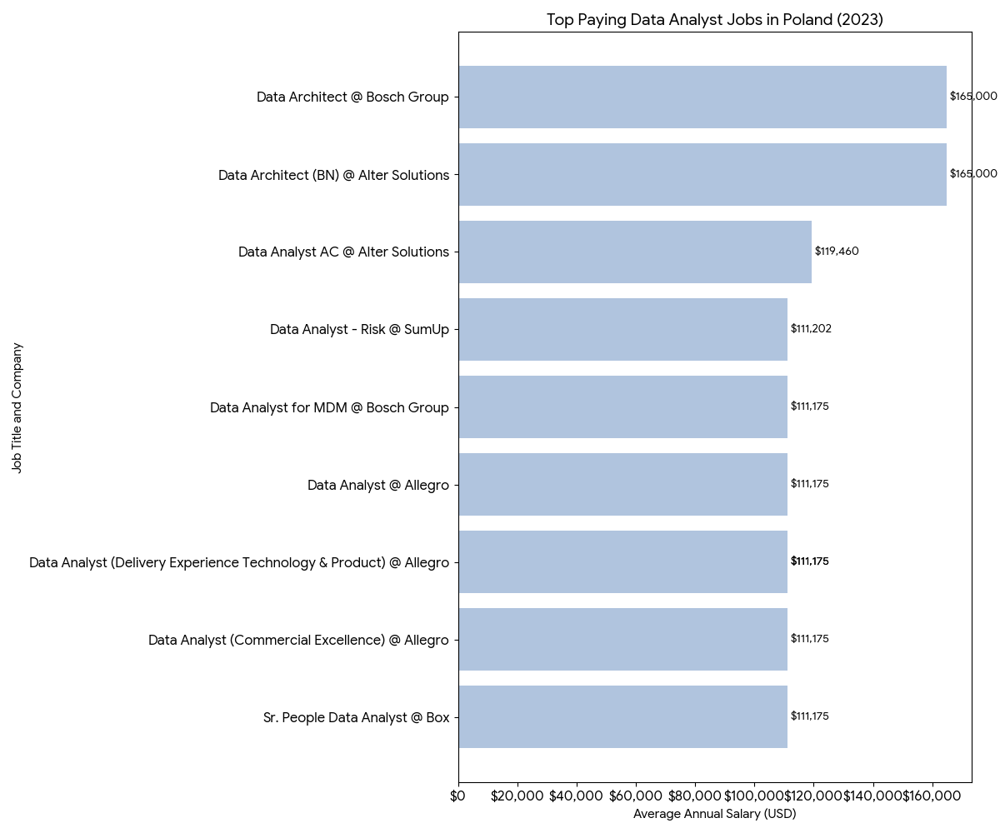
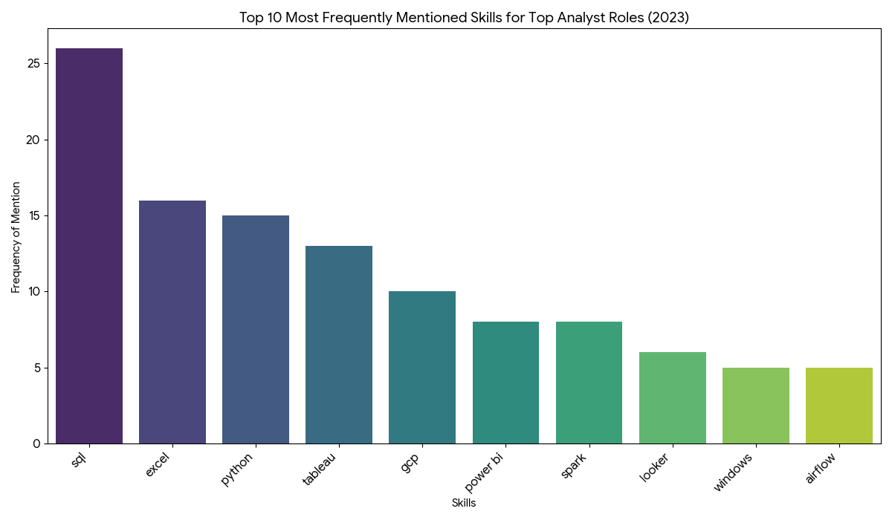

# Introduction

Welcome to my SQL Portfolio Project, where I delve into the Polish data job market in the 2023 with a focus on data analyst roles. This project is a personal exploration into identifying the top-paying jobs, in-demand skills, and the intersection of high demand with high salary in the field of data analytics. This project served as the capstone assignment for my data analytics course, allowing me to apply all the key SQL concepts learned.

Check out my SQL queries here: [SQL Queries](./project_sql)

### **Background**

The motivation behind this project stemmed from my desire to understand the data analyst job market better. I aimed to discover which skills are paid the most and in demand, making my job search more targeted and effective. 

The data for this analysis is from the ([Luke Barousse’s SQL Course](https://www.lukebarousse.com/sql)). This data includes details on job titles, salaries, locations, and required skills. 

The questions I wanted to answer through my SQL queries were:

1. What are the top-paying data analyst jobs?
2. What skills are required for these top-paying jobs?
3. What skills are most in demand for data analysts?
4. Which skills are associated with higher salaries?
5. What are the most optimal skills to learn for a data analyst looking to maximize job market value?

### **Tools I Used**

In this project, I utilized a variety of tools to conduct my analysis:

- **SQL** (Structured Query Language): Enabled me to interact with the database, extract insights, and answer my key questions through queries.
- **PostgreSQL**: As the database management system, PostgreSQL allowed me to store, query, and manipulate the job posting data.
- **Visual Studio Code:** This open-source administration and development platform helped me manage the database and execute SQL queries.

# The Analysis

### **1. Top Paying Data Analyst Jobs**

To identify the highest-paying roles, I filtered data analyst positions by average yearly salary and location, focusing on the Polish job market. This query highlights the high paying opportunities in the field.

```sql
SELECT	
	job_id,
	job_title,
	job_location,
	job_schedule_type,
	salary_year_avg,
	job_posted_date, 
  company_dim.name
FROM
    job_postings_fact
    LEFT JOIN company_dim ON job_postings_fact.company_id = company_dim.company_id
WHERE
        job_title_short = 'Data Analyst' 
    AND job_location LIKE '%Poland%'
    AND salary_year_avg IS NOT NULL
ORDER BY salary_year_avg DESC
LIMIT 10;
```
Here's the breakdown of the top data analyst jobs in 2023 in Poland, based on your query:

* **Clear Salary Tiers:** The top 10 paying data jobs show a distinct range, from **$111,000 to $165,000 USD**. The highest salaries are reserved for **Data Architect** roles, indicating a premium for architectural skills over general analysis in this top bracket.

* **Prominent Tech and Consulting Employers:** Companies like **Allegro**, **Bosch Group**, and **Alter Solutions** are the most frequent high-paying employers in this list, showing a strong demand for data talent within Poland's e-commerce, technology, and consulting sectors.

* **Variety in High-Paying Roles:** Beyond the top Data Architect positions, there is a high diversity in job titles, including specializations like **Risk**, **People Data**, and **Commercial Excellence**. This reflects a growing need for data analysts with specific domain expertise.
  

*Bar graph visualizing the salary for the top 10 salaries for data analysts; Gemini generated this graph from my SQL query results*


### **2. Skills for Top Paying Jobs**

To understand what skills are required for the top-paying jobs, I joined the job postings with the skills data, providing insights into what employers value for high-compensation roles.

```sql
WITH top_paying_jobs AS (
    SELECT	
        job_id,
        job_title,
        job_location,
        salary_year_avg,
        salary_hour_avg,
        company_dim.name
    FROM
        job_postings_fact
        LEFT JOIN company_dim ON job_postings_fact.company_id = company_dim.company_id
    WHERE
            job_title_short = 'Data Analyst' 
        AND job_location LIKE '%Poland%'
        AND (salary_year_avg IS NOT NULL or salary_hour_avg IS NOT NULL)
)
SELECT 
    top_paying_jobs.*,
    skills
FROM top_paying_jobs
INNER JOIN skills_job_dim ON top_paying_jobs.job_id = skills_job_dim.job_id
INNER JOIN skills_dim ON skills_job_dim.skill_id = skills_dim.skill_id
ORDER BY salary_year_avg DESC
```

This suggests that strong foundational skills in data querying (SQL), data manipulation and analysis (Excel, Python), and data visualization (Tableau, Power BI, Looker) are highly sought after. Additionally, cloud platforms (GCP), big data processing (Spark), and workflow automation (Airflow) are also significant.


*Bar graph visualizing the count of skills for the top 10 paying jobs for data analysts; Gemini generated this graph from my SQL query results*

### **3. In-Demand Skills for Data Analysts**

This query helped identify the skills most frequently requested in job postings, directing focus to areas with high demand.

```sql
SELECT 
    skills, 
    count(skills_job_dim.job_id) AS demand_count
FROM job_postings_fact
INNER JOIN skills_job_dim ON job_postings_fact.job_id = skills_job_dim.job_id
INNER JOIN skills_dim ON skills_job_dim.skill_id = skills_dim.skill_id
WHERE 
    job_title_short = 'Data Analyst' AND
    job_location LIKE '%Poland%'
GROUP BY 
    skills
ORDER BY
    demand_count DESC
LIMIT 5
```

This data reveals the most in-demand skills for data analyst positions. **SQL** and **Excel** are the clear front-runners, highlighting their status as foundational, essential tools for data manipulation and analysis. Following closely is **Python**, indicating the high value placed on programming skills for more advanced tasks. Finally, the significant demand for both **Tableau** and **Power BI** shows the critical importance of data visualization and business intelligence platforms in the industry.

| Skill    | Demand Count |
|----------|--------------|
| sql      | 1415         |
| excel    | 1095         |
| python   | 857          |
| tableau  | 619          |
| power bi | 594          |

### **4. Skills Based on Salary**

Exploring the average salaries associated with different skills revealed which skills are the highest paying.

```sql
SELECT 
    skills,
    round(avg(salary_year_avg), 0) AS average_salary
FROM job_postings_fact
INNER JOIN skills_job_dim ON job_postings_fact.job_id = skills_job_dim.job_id
INNER JOIN skills_dim ON skills_job_dim.skill_id = skills_dim.skill_id
WHERE 
    job_title_short = 'Data Analyst' AND
    job_location LIKE '%Poland%' AND
    salary_year_avg IS NOT NULL 
    
GROUP BY 
    skills
ORDER BY
    average_salary DESC
LIMIT 25;
```

Expertise in big data (Hadoop, Spark) and cloud platforms (AWS, Snowflake) commands the highest salaries. While foundational skills like SQL and Python are essential, they are most lucrative when combined with these specialized cloud and infrastructure skills. Additionally, proficiency in automation (Airflow), project management (Jira), and version control (Git) is increasingly valuable, reflecting a growing demand for analysts with structured development and process management abilities.

| Skill | Average Salary (USD) |
|---|---|
| mongo | $165,000 |
| linux | $165,000 |
| aws | $165,000 |
| hadoop | $133,750 |
| nosql | $131,750 |
| sas | $111,175 |
| bigquery | $111,175 |
| jira | $111,175 |
| qlik | $111,175 |
| snowflake | $111,175 |]

*Table of the average salary for the top 10 paying skills for data analysts*

### **5. Most Optimal Skills to Learn**
   
Combining insights from demand and salary data, this query aimed to pinpoint skills that are both in high demand and have high salaries, offering a strategic focus for skill development.

```sql
WITH skills_demand AS 
        (
    SELECT 
        skills_job_dim.skill_id,
        skills_dim.skills, 
        count(skills_job_dim.job_id) AS demand_count
    FROM job_postings_fact
    INNER JOIN skills_job_dim ON job_postings_fact.job_id = skills_job_dim.job_id
    INNER JOIN skills_dim ON skills_job_dim.skill_id = skills_dim.skill_id
    WHERE 
        job_title_short LIKE '%Data%' AND
        job_location LIKE '%Poland%' AND
        salary_year_avg IS NOT NULL 
    GROUP BY 
        skills_job_dim.skill_id, skills_dim.skills
        )
,average_salary AS 
        (
    SELECT 
        skills_job_dim.skill_id,
        skills_dim.skills,
        round(avg(salary_year_avg), 0) AS average_salary
    FROM job_postings_fact
    INNER JOIN skills_job_dim ON job_postings_fact.job_id = skills_job_dim.job_id
    INNER JOIN skills_dim ON skills_job_dim.skill_id = skills_dim.skill_id
    WHERE 
        job_title_short LIKE '%Data%' AND
        job_location LIKE '%Poland%' AND
        salary_year_avg IS NOT NULL 
        
    GROUP BY 
        skills_job_dim.skill_id, skills_dim.skills
        )

SELECT 
    skills_demand.skill_id,
    skills_demand.skills,
    demand_count,
    average_salary
FROM 
    skills_demand
INNER JOIN average_salary ON skills_demand.skill_id = average_salary.skill_id
ORDER BY
    demand_count DESC
LIMIT 25;
```
| Skill | Demand Count | Average Salary (USD) |
|---|---|---|
| sql | 93 | $115,842 |
| python | 75 | $114,496 || spark | 51 | $111,011 |
| gcp | 33 | $99,569 |
| tableau | 29 | $121,664 |
| azure | 27 | $116,088 |
| aws | 26 | $120,463 |
| snowflake | 24 | $135,870 |
| bigquery | 23 | $119,815 |
| excel | 21 | $76,035 |
| airflow | 21 | $113,875 |
| hadoop | 17 | $106,125 |
| scala | 17 | $106,736 |
| git | 15 | $115,627 |
| r | 14 | $103,887 |

*Table of the most optimal skills for data analyst sorted by salary*

Here's a breakdown of the most valuable skills for Data Analysts, based on the provided data:

* **Core Foundational Skills:** **SQL** and **Python** show the highest demand, with counts of 93 and 75 respectively. Their strong average salaries of around **$115,842** for SQL and **$114,496** for Python confirm their status as essential, high-value skills for any data analyst.

* **High-Value Cloud and Big Data Technologies:** Specialized skills in cloud data warehousing and big data command the highest salaries. **Snowflake** leads with an average salary of **$135,870**, followed closely by cloud platforms like **AWS** ($120,463) and **Azure** ($116,088), indicating a strong market premium for professionals who can manage data in modern cloud environments.

* **Business Intelligence and Visualization:** **Tableau** stands out with a high average salary of **$121,664**. This highlights the critical importance of data visualization and the ability to translate complex data into clear, actionable insights for business stakeholders.

* **Essential Supporting Tools:** While fundamental, **Excel** shows a lower average salary of **$76,035**, suggesting it's a baseline expectation rather than a high-paying specialty. In contrast, skills related to development practices, like **Git**, command a strong salary of **$115,627**, reflecting the value of version control and collaborative coding in data projects.

## **What I Learned**

This project was a great opportunity to put my SQL skills to the test and learn how to extract real-world insights. Here’s what I've added to my toolkit:

* **Connecting the Dots with JOINs:** I got comfortable combining different tables using `INNER JOIN` and `LEFT JOIN` to bring company names and skill details together with job postings.

* **Summarizing with GROUP BY:** I learned to use `GROUP BY` with `COUNT()` and `AVG()` to aggregate data effectively, allowing me to calculate skill demand and average salaries.

* **Targeted Data Retrieval:** I practiced filtering data precisely using the `WHERE` clause with conditions like `LIKE` and `IS NOT NULL` to focus on the exact information I needed for my analysis.

* **Tackling Complex Questions:** Using Common Table Expressions (CTEs) with the `WITH` clause was a major step forward. It allowed me to break down complex problems into simpler, logical steps, like finding the most optimal skills by combining demand and salary data.

## **Conclusions**

My analysis of the Polish data analyst job market in 2023 revealed several key insights:

* **Top-Paying Data Analyst Jobs:** The highest-paying roles, reaching up to **$165,000**, are often senior or specialized positions like Data Architect.
* **Skills for Top-Paying Jobs:** High salaries are linked to a hybrid skillset that combines foundational tools like **SQL** and **Python** with expertise in cloud and big data technologies.
* **Most In-Demand Skills:** **SQL** and **Excel** are the most frequently requested skills, establishing them as the essential foundation for any data analyst role in Poland.
* **Skills with Higher Salaries:** Specialized skills in cloud platforms like **AWS** and **Snowflake**, and big data tools like **Hadoop**, are associated with the highest average salaries.
* **Optimal Skills for Job Market Value:** **SQL** and **Python** represent the sweet spot, offering the best combination of high employer demand and excellent compensation, making them the most strategic skills to master.

## **Final Thoughts**

This project successfully translated complex job market data into a clear and actionable career guide. The key takeaway is that while a strong foundation in SQL and Python is crucial, the path to a top-tier salary involves specializing in modern technologies like cloud platforms and big data tools. These findings now give me a focused strategy for my continued learning and professional development.
